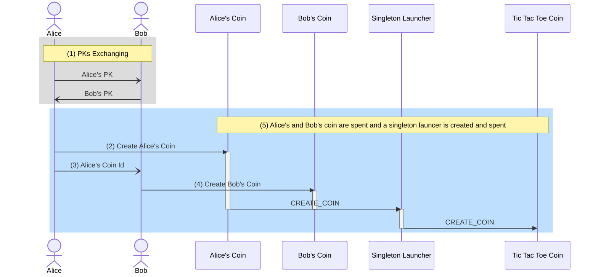
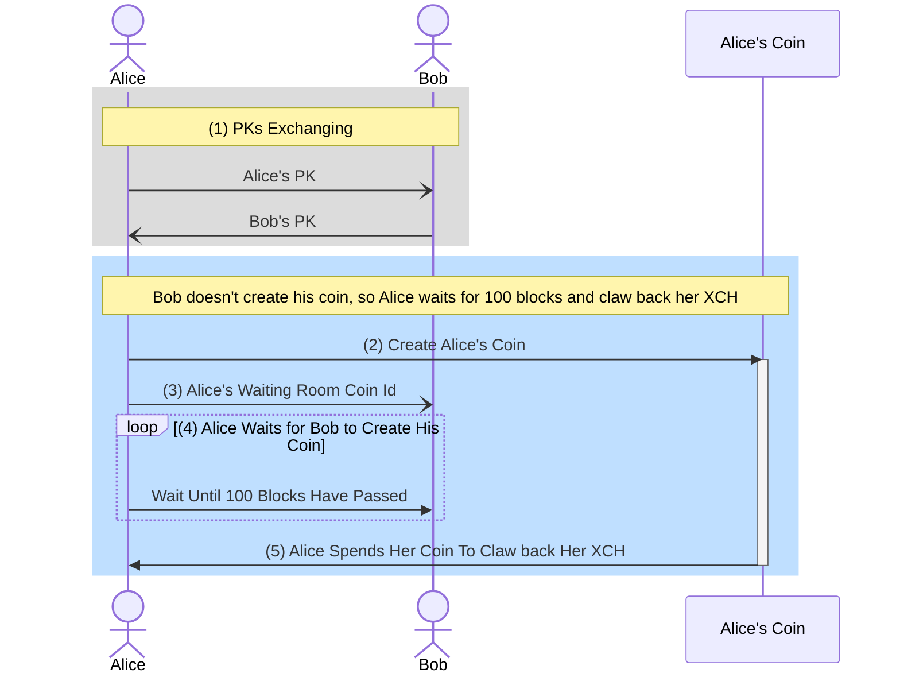
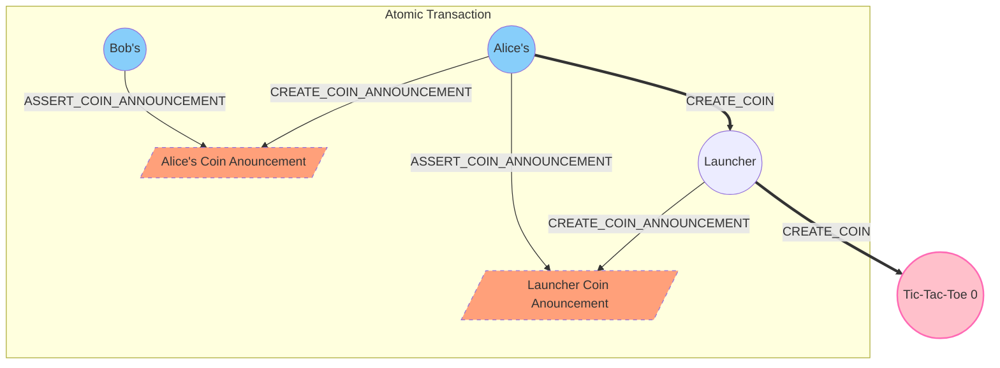

# Chia Tic Tac Toe

This repository is the continued work of tic-tac-toe game on Chia Blockchain from [chia-concepts/tic-tac-toe](https://github.com/kimsk/chia-concepts/blob/main/notebooks/misc/tic-tac-toe/README.md).

## Creating Tic Tac Toe Coin

In the chia-concepts/tic-tac-toe, in order to create [an initial singleton game coin](https://github.com/kimsk/chia-concepts/blob/main/notebooks/misc/tic-tac-toe/singleton.ipynb), both Alice and Bob have to be able to sign and spend their coins together.


The process is cumbersome and requires Bob to trust Alice not to steal his coin (because Bob has to provide his signature for his coin spend). Also, both Alice and Bob can't use standard wallets and have to prepare conditions for the standard spend manually.

```python
# alice's coin creates a launcher coin
alice_conditions = [
    # create launcher coin with the odd_amount (odd)
    Program.to(
        [
            ConditionOpcode.CREATE_COIN,
            singleton_top_layer_v1_1.SINGLETON_LAUNCHER_HASH,
            game_amount,
        ]),
    # assert launcher coin announcement
    Program.to(
        [
            ConditionOpcode.ASSERT_COIN_ANNOUNCEMENT, 
            std_hash(launcher_id + launcher_announcement)
        ]),
    
    # change
    [ConditionOpcode.CREATE_COIN, alice.puzzle_hash, alice_coin.amount - (player_amount + 1)]
]

# bob's coin create change back to himself
bob_conditions = [
    [ConditionOpcode.CREATE_COIN, bob.puzzle_hash, bob_coin.amount - player_amount],
]
```

To resolve the issue, we introduced the [waiting room puzzle](https://github.com/kimsk/chia-tic-tac-toe/blob/main/code/waiting-room.clsp) allowing both Alice and Bob to send XCH to create their waiting room coins using their standard wallets.

Once the waiting room coins for both players are on the blockchain. Alice can create a spend bundle by spending two waiting room coins to create a Tic Tac Toe game coin.

If either Alice or Bob or both decide not to play the game (e.g., only one waiting room coin is created or both waiting room coins are created, but Alice doesn't spend them to create a game coin), players can claw back their XCH.

Each waiting coin also curries in the `RETURN_AMOUNT` (for clawback) and `GAME_AMOUNT` (amount to get when someone wins) that are agreed upon before creating the game.

### Waiting Room Puzzle
```clojure
; PLAYER_PH                     : Player Puzzle Hash (for Clawback)
; P1_PK                         : Player One PK
; P2_PK                         : Player Two PK
; P1_COIN_ID                    : P1 coin id, null if this is P1 coin
; RETURN_AMOUNT                 : Amount returned to player when clawback in mojos
; GAME_AMOUNT                   : Odd game amount in mojos
; launcher_coin_announcement    : Expected coin announcement from the launcher coin, null if Clawback
```
#### Creating a tic tac toe coin


1. Alice (P1) and Bob (P2) exchange their PKs.
2. Alice creates her waiting room coin (Alice's coin) with her `puzzle_hash`, `pk`, bob's `pk`, `null` for `P1_COIN_ID`, and agreed `RETURN_AMOUNT` and `GAME_AMOUNT`.
3. Alice provides her waiting room `coin id` to Bob. 
4. Bob creates his waiting room coin (Bob's coin) with his `puzzle_hash`, Alice's `pk`, his `pk`, Alice's `coin id` from Alice, and agreed `RETURN_AMOUNT` and `GAME_AMOUNT`.
5. Once two coins with Alice's and Bob's waiting room puzzles are created, Alice's and Bob's coin spends can be spent together in a spend bundle to create the tic tac toe singleton coin. Alice's coin creates an ephermeral launcher coin that creates the game coin. Bob's coin is burned.

#### Clawback
> The waiting room puzzle for Alice allows the clawback after 100 blocks has passed if Bob has not created his waiting room coin. Or if Bob has created his coin, but Alice clawed back her XCH and didn't create a game.



1. Alice (P1) and Bob (P2) exchange their PKs.
2. Alice creates her coin with her `puzzle_hash`, `pk`, bob's `pk`, and null for `P1_COIN_ID`.
3. Alice provides her waiting room `coin id` to Bob.
4. Alice waits for Bob to create his waiting room coin.
5. After 100 blocks have passed, Alice can spend her waiting room coin to claw back her XCH.

### Security
> Alice's, Bob's, and the launcher coin have to be spent together in one transaction to create a singleton tic-tac-toe game coin.

- When Alice's coin is spent, the launcher coin is created and spent in the same transaction. The launcher coin also creates the game coin and generates the coin announcement. Alice's coin then asserts the launcher coin announcement.
```clojure
(list ASSERT_COIN_ANNOUNCEMENT launcher_coin_announcement)
```
- Alice provides `launcher_coin_announcement` in a solution and sign it with her secret key.
```python
alice_waiting_room_coin_spend = CoinSpend(
    alice_waiting_room_coin,
    alice_waiting_room_puzzle,
    Program.to([
        launcher_coin_announcement
    ])
)
...
message: bytes = launcher_coin_announcement
sig_alice_spend: G2Element = AugSchemeMPL.sign(
    alice_sk,
    message
    + alice_waiting_room_coin.name()
    + DEFAULT_CONSTANTS.AGG_SIG_ME_ADDITIONAL_DATA
)
```
- Alice's coin verifies the signature.
```clojure
(list AGG_SIG_ME P1_PK launcher_coin_announcement)
```

- Both Alice's and Bob's coins are curried in both players' PKs and agreed amounts which is also provided to the launcher coin as Key/Value. A tree hash of the launcher solution is `launcher_announcement` which will be asserted when all coins are spent. 
- Key/Value List for the launcher coin:
```python
launcher_solution = Program.to(
    [
        singleton_puzzle.get_tree_hash(),
        game_amount,
        [
            ("game", "tic-tac-toe"), 
            ("p1_pk", alice_pk),
            ("p2_pk", bob_pk),
            ("return_amount", play_amount),
            ("game_amount", game_amount)
        ]
    ]
)

launcher_announcement = launcher_solution.get_tree_hash()
```
- Bob's coin is curried with Alice's `coin id` (`P1_COIN_ID`).
- Bob's coin also asserts the launcher coin announcement announced by Alice's coin.
```clojure
(list ASSERT_COIN_ANNOUNCEMENT (sha256 P1_COIN_ID launcher_coin_announcement))
```
- In Clawback case, a player has to sign their `puzzle hash` and the `return amount` with their secret key to claw back their XCH. The clawback case is valid only after 100 blocks have passed after the waiting room coin is created.
```clojure
  (defconstant CLAWBACK_BLOCKS 100)
  ...
  (defun-inline clawback (PLAYER_PH RETURN_AMOUNT)
        (list 
            (list ASSERT_HEIGHT_RELATIVE CLAWBACK_BLOCKS) ; clawback condition valid after CLAWBACK_BLOCKS blocks have passed
            (list CREATE_COIN PLAYER_PH RETURN_AMOUNT) ; return mojos to player 
            (list 
                AGG_SIG_ME
                (if P1_COIN_ID
                    P2_PK
                    P1_PK
                )
                (sha256 PLAYER_PH RETURN_AMOUNT))
        )
    )
```

## Notebooks
- [Clawback](./notebook/clawback.ipynb)
- [Playing Tic Tac Toe Game](./notebook/play-game-sim.ipynb)

## References
- [chia-concepts/tic-tac-toe](https://github.com/kimsk/chia-concepts/blob/main/notebooks/misc/tic-tac-toe/README.md)
- [richardkiss/chiaswap](https://github.com/richardkiss/chiaswap)


