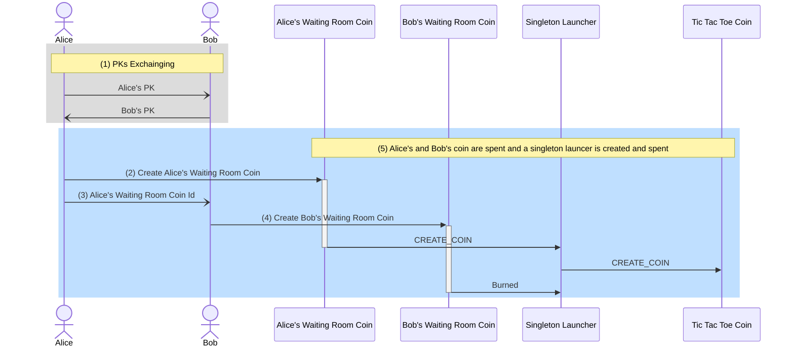
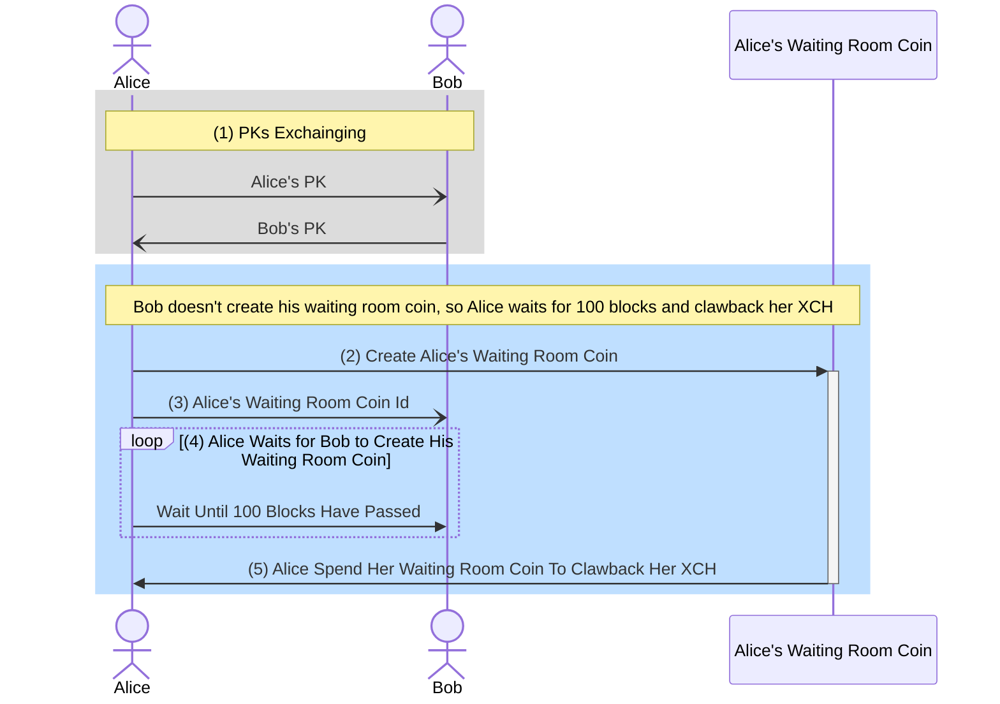

# Chia Tic Tac Toe

This repo is the continued work of tic-tac-toe game on Chia Blockchain from [chia-concepts -- tic-tac-toe](https://github.com/kimsk/chia-concepts/blob/main/notebooks/misc/tic-tac-toe/README.md).

## Creating Tic Tac Toe Coin

In the [chia-concepts -- tic-tac-toe](https://github.com/kimsk/chia-concepts/blob/main/notebooks/misc/tic-tac-toe/README.md), in order to create [an initial singleton game coin](https://github.com/kimsk/chia-concepts/blob/main/notebooks/misc/tic-tac-toe/singleton.ipynb), both Alice and Bob have to be able to sign and spend their coins together.


The process is cumbersome and requires Bob to trust Alice not to steal his coin (because Bob has to provide his signature for his coin spend). Also, both Alice and Bob can't use standard wallets and have to provide conditions manually.

```python
# alice's coin creates a launcher coin
alice_conditions = [
    # create launcher coin with the odd_amount (odd)
    Program.to(
        [
            ConditionOpcode.CREATE_COIN,
            singleton_top_layer_v1_1.SINGLETON_LAUNCHER_HASH,
            game_amount,
        ]),
    # assert launcher coin announcement
    Program.to(
        [
            ConditionOpcode.ASSERT_COIN_ANNOUNCEMENT, 
            std_hash(launcher_id + launcher_announcement)
        ]),
    
    # change
    [ConditionOpcode.CREATE_COIN, alice.puzzle_hash, alice_coin.amount - (player_amount + 1)]
]

# bob's coin create change back to himself
bob_conditions = [
    [ConditionOpcode.CREATE_COIN, bob.puzzle_hash, bob_coin.amount - player_amount],
]
```

To resolve the issue, we introduced the [waiting room puzzle](https://github.com/kimsk/chia-tic-tac-toe/blob/main/code/waiting-room.clsp) allowing both Alice and Bob to send XCH to create their waiting room coins using their standard wallets.

If either Alice or Bob or both decide not to play the game (e.g., only one waiting room coin is created or both waiting room coins are created, but Alice doesn't spend them to create a game coin), players can claw back their XCH.

Once the waiting room coins for both players are on blockchain. Alice can create a spend bundle spending two waiting room coins to create a Tic Tac Toe game coin. 

### Phase 1 -- Waiting Room Puzzle

#### Waiting Room Puzzle Solution
```clojure
; PLAYER_PH                     : Player Puzzle Hash (for Clawback)
; P1_PK                         : Player One PK
; P2_PK                         : Player Two PK
; P1_COIN_ID                    : P1 coin id, null if this is P1 coin
; RETURN_AMOUNT                 : Amount returned to player when clawback in mojos
; GAME_AMOUNT                   : Odd game amount in mojos
; launcher_coin_announcement    : Expected coin announcement from the launcher coin, null if Clawback
```
#### Creating a tic tac toe coin


1. Alice (P1) and Bob (P2) exchange their PKs.
2. Alice creates her waiting room coin with her `puzzle_hash`, `pk`, bob's `pk`, and null for `P1_COIN_ID`.
3. Alice provides her waiting room `coin id` to Bob. 
4. Bob creates his waiting room coin with his `puzzle_hash`, Alice's `pk`, his `pk` and Alice's `coin id` from Alice.
5. Once two coins with Alice's and Bob's waiting room puzzles are created, a spend bundle with Alice's and Bob's coin spends can be spent to create the tic tac toe singleton coin. Alice's coin creates an ephermeral launcher coin that creates the game coin. Bob's coin is burned.

#### Clawback
> The waiting room puzzle for Alice allows the clawback after 100 blocks has passed if Bob has not created his waiting room coin and vice versa.



1. Alice (P1) and Bob (P2) exchange their PKs.
2. Alice creates her waiting room coin with her `puzzle_hash`, `pk`, bob's `pk`, and null for `P1_COIN_ID`.
3. Alice provides her waiting room `coin id` to Bob.
4. Alice waits for Bob to create his waiting room coin.
5. After 100 blocks have passed, Alice can spend her waiting room coin to clawback her XCH.

### Security
- Alice's coin asserts coin announcement from the launcher coin.
- Alice signs hash of `launcher_id` and `singleton_full_puzzle_hash`.
- Alice's coin verifies the signature.
```clojure
(list AGG_SIG_ME P1_PK launcher_coin_announcement)
```
- Bob's coin asserts (launcher) coin announcement from the Alice's coin.
- Both Alice's and Bob's coins are curried in both players' PK which is also provided to the launcher coin as Key/Value.
- Key/Value List for the launcher coin:
```clojure
(
    ("game" . "tic-tac-toe")
    ("p1_pk" . <alice_pk>)
    ("p2_pk" . <bob_pk>)
)
```
- Bob's coin is curried with Alice's `coin id`

- When Alice's coin is spent, the launcher coin is created, spent, creating the game coin and generate the coin announcement. Alice's coin calculates coin announcement and assert it.
```clojure
(list ASSERT_COIN_ANNOUNCEMENT launcher_coin_announcement)
```

- When Bob's coin is spent, Bob's coin calculates coin annoucement and assert it.
```clojure
(list ASSERT_COIN_ANNOUNCEMENT (sha256 P1_COIN_ID launcher_coin_announcement))
```

## Notebooks
- [Clawback](./notebook/clawback.ipynb)
- [Playing Tic Tac Toe Game](./notebook/play-game-sim.ipynb)

## References
- [chia-concepts/tic-tac-toe](https://github.com/kimsk/chia-concepts/blob/main/notebooks/misc/tic-tac-toe/README.md)
- [richardkiss/chiaswap](https://github.com/richardkiss/chiaswap)


